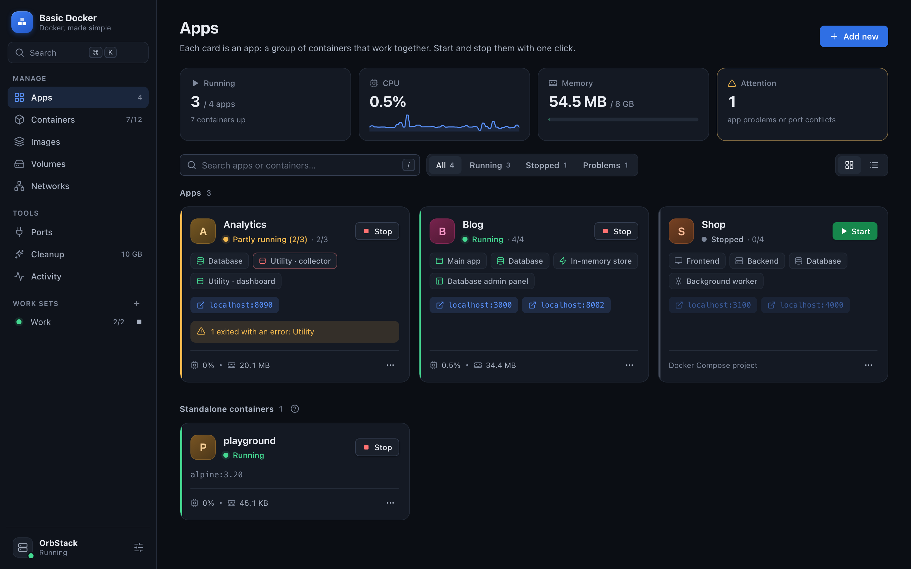
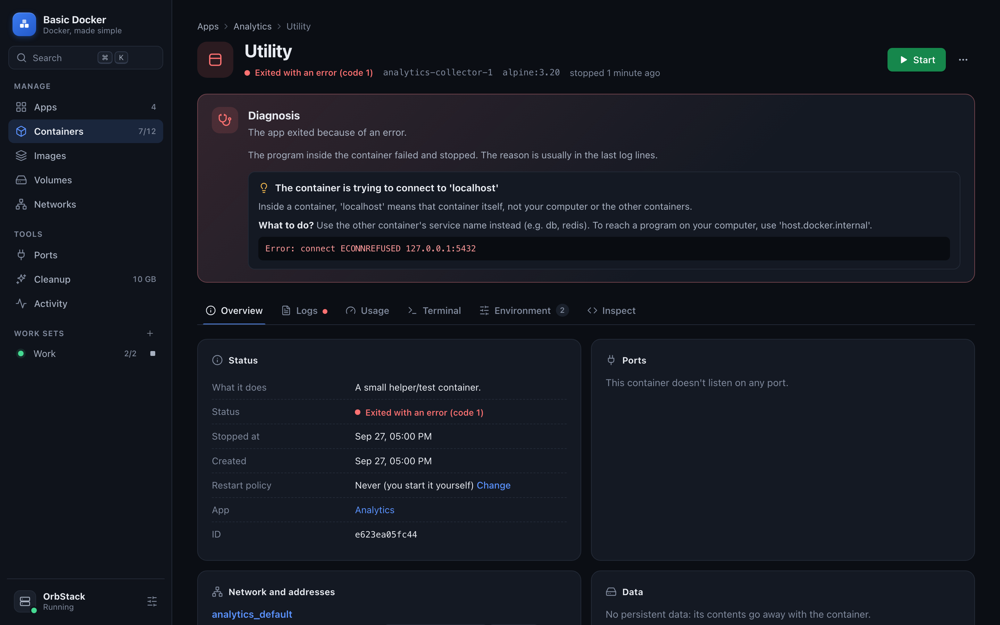
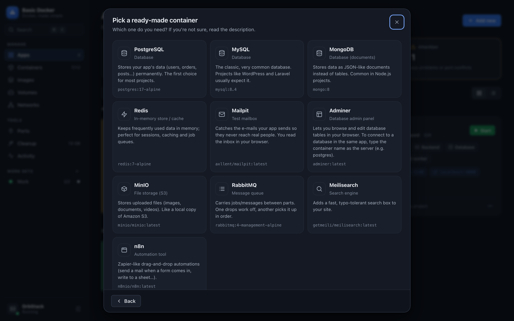
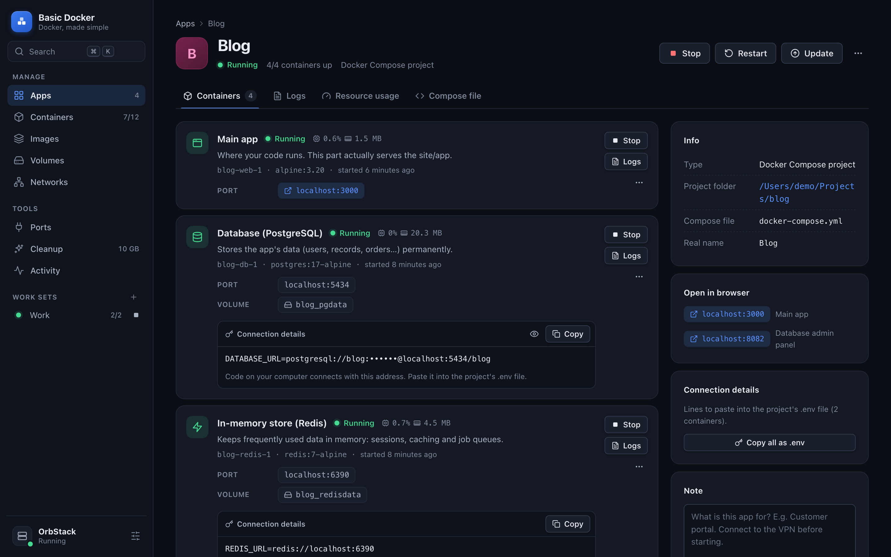

# Basic Docker

[Türkçe](README.md) · **English**

**A desktop app that manages Docker in plain language.** Built natively for the Mac; the Windows version is experimental.
A project with 5 containers shows up as a single card. One click starts them all, one click stops them all.
And when something breaks, it **tells you why in plain words.**



Docker Desktop is powerful but crowded. Once names like `project-web-1`, `project-db-1`, `project-redis-1`,
`project-worker-1` pile up, it gets hard to tell what is what. Basic Docker groups them into **apps** and explains
what each container does. Works with **Docker Desktop, OrbStack and Colima**.
The interface is available in **English and Turkish**; switch in System settings or with ⌘K → "Türkçeye geç".

## What does it do?

### Everyday work

- **One app = one card.** Docker Compose projects are grouped automatically. Standalone containers can be moved onto any card. Card or list view.
- **One click.** Start brings up every container of an app in the right order, Stop shuts them all down.
- **Work sets.** Create sets like "Work" or "Side projects" and start/stop several apps together from the sidebar.
- **Every container is explained.** "Database (PostgreSQL)", "Background worker", "Scheduler", "Test mailbox" and so on.
- **Connection strings, ready to paste.** Database containers come with a `DATABASE_URL=…` line for your `.env` file, copied with one click; all connections of an app can be copied as a single `.env` too.
- **Live resource usage.** CPU, memory, network and disk for each container, with small charts.
- **Logs.** Search, "errors only", time range, live follow. Read the logs of all containers of an app in one stream.
- **Step inside a container: a real terminal.** A full terminal (xterm.js) running inside the container, right in the app: `cd`, tab completion, colors, `top` and `vim` work. Enter as root if you like; the session survives moving between pages. Ready-made commands per database are typed into the terminal with one click.
- **For Compose projects:** Update (pull new versions, recreate what changed), rebuild your code, view the compose file.

### What Docker Desktop and OrbStack don't have

- **Diagnosis: "Why did it stop?"** Translates the exit code and known errors in the logs into plain language and tells you what to do. Examples: port already in use, wrong password (the "database password is only set on first start" trap), using `localhost` inside a container, running an Intel image on Apple Silicon, Windows line endings, disk full, missing table (migration)… Error lines in the logs get a short explanation next to them.
- **One-click backup and restore.** Back up a volume to your Mac as `.tar.gz`; take a proper **dump** of PostgreSQL / MySQL / MariaDB / MongoDB with the database's own tool. Restore into a new volume or over an existing one. Deleted backups go to the Trash.
- **Port map.** Who is using which port on your computer: Docker containers, other programs and macOS itself (e.g. the AirPlay Receiver holding 5000/7000). Warns "starting this app will cause a port conflict", flags ports open to your whole network and finds free ports.
- **Smart cleanup.** Breaks Docker's disk usage down by category; preselects the safe ones like build cache and dangling images, makes you pick the risky ones (volumes) one by one and offers a backup before deleting.
- **Activity history.** Docker keeps this history short; Basic Docker records what happens while it is open (started, stopped, crashed, ran out of memory…). If a container crashes unexpectedly you get a **macOS notification**.
- **Image update check.** Is there a newer version of your images on Docker Hub? Also flags images built for Intel (amd64) that run slowly under emulation on your Mac. Removes many old versions of an image in one go.
- **English and Turkish.** The whole interface, the diagnosis texts and the template list are available in both languages.
- **Remote Docker (like VS Code).** Add the Docker on your server, home server or VM over SSH and manage it from here.
  No password is asked, your SSH key is used, and all commands share a single SSH connection.
  Clicking a remote container's link opens an **SSH tunnel** automatically: a site running on port 3000 on the server
  opens at `localhost:3000` on this Mac. Ports like databases get a one-click tunnel. If it can't connect it tells you why
  (key not authorized, no Docker on the server, user not in the docker group, tunnels disabled…).



### Everything else

- **Containers:** all containers in one table; sort, filter and bulk start/stop/delete. Pause, kill, restart policy, connect to another network, environment variables (passwords hidden) and the raw `docker inspect` output.
- **Images:** pull, run, inspect layers, delete. **Volumes:** create, back up, delete. **Networks:** which container is on which network with which IP and name; create, connect, disconnect, delete.
- **System:** engine info (OrbStack / Docker Desktop / Colima / remote server), versions, switching between connections, connection test (latency and version), open SSH tunnels. If the engine is stopped it opens the right app (OrbStack or Docker Desktop); if a remote server is unreachable, one click switches back to the Docker on this Mac.
- **Search anywhere: ⌘K.** Type an app, container, page or action and press Enter ("start blog", "cleanup"…). Other shortcuts: ⌘N add new, ⌘1…⌘9 pages, `/` search.
- Light / dark theme (follows macOS), English / Turkish interface, narrow sidebar, works well in small windows.

### Three ways to add something new

- **Ready-made container:** PostgreSQL, MySQL, MongoDB, Redis, Mailpit, Adminer, MinIO, RabbitMQ, Meilisearch, n8n. Password, port and volume are set up for you.
- **My project folder:** pick a folder with a `docker-compose.yml` and everything is set up at once.
- **Image from Docker Hub:** run any image with your own ports and settings.





## Installation

### Download (easiest)

Get the file for your computer from the [Releases](https://github.com/benysff/basic-docker/releases/latest) page:

| Computer | File |
|---|---|
| Mac (M1/M2/M3/M4…) | `Basic-Docker-macOS-AppleSilicon.zip` |
| Mac (Intel) | `Basic-Docker-macOS-Intel.zip` |
| Windows 10/11 (experimental) | `Basic-Docker-Windows.zip` |

No Python needed; everything is in the package. The app isn't signed, so the Mac warns on first launch:
System Settings → Privacy & Security → **Open Anyway**. On Windows, if SmartScreen warns, choose **More info → Run anyway**.

### Install from source (Mac)

Requirements: **macOS 11+**, **Python 3.9+** (comes with macOS) and a Docker engine:
**[OrbStack](https://orbstack.dev)** (the lightest on a Mac) or **[Docker Desktop](https://www.docker.com/products/docker-desktop/)**.

```bash
git clone https://github.com/benysff/basic-docker.git
cd basic-docker
./kur.command
```

Installation takes 1-2 minutes. When it's done the app is placed in your **Applications** folder and opens.
From then on, open it from Launchpad or Spotlight (⌘ + space → *Basic Docker*); no terminal needed.
The interface starts in Turkish; switch to English under **Sistem ve ayarlar → Dil / Language**.

> If you move the cloned folder or update it with `git pull`, run `./kur.command` again.

## FAQ

**Will my new project show up automatically?**
If you started it with `docker compose up`, yes, it becomes a card by itself. Containers started one by one with
`docker run` show up as separate cards; merge them with **Add to an app** in the details.

**Does the card disappear if I run `docker compose down`?**
No. Compose projects are remembered. Press Start on the card and it is set up again from the project folder.

**Will deleting remove my data?**
Not by default. Data (volumes) is kept. To delete it you have to tick "Delete the data too" as well.
Your project folder and code are never touched. If you're not sure, **Back up** first.

**Where are backups stored?**
In `~/Documents/Basic Docker Yedekleri` (can be changed on the System page). Volume backups use a tiny helper
image (`alpine`, ~3 MB) once; it is downloaded if you don't have it.

**How do I connect to Docker on a remote server?**
System → **Add remote Docker** → enter the server address (`user@server`, an IP or a name from `~/.ssh/config`).
If `ssh user@server` works in Terminal without a password, you're ready; Docker must be installed on the server and your
user must be in the `docker` group. The connection is saved as a Docker context, so the `docker` command in your terminal
sees the same server. To go back, pick the engine on this Mac on the System page.

**Is it safe?**
Ports of ready-made containers are only opened to your own computer (`127.0.0.1`); others on the network can't
reach them. The app opens nothing to the network; it runs entirely locally and only uses the `docker` command. It only
goes online when you ask it to (pulling images, checking for updates).

## How does it work?

Basic Docker is a Python app. It shows its interface in a native macOS window (WKWebView; WebView2 on Windows) using
[pywebview](https://pywebview.flowrl.com/). There is no web server or port: the interface calls Python functions directly.
It talks to Docker only through the `docker` command line tool.

Containers are grouped in this order:

1. Created with Basic Docker (`basicdocker.app` label)
2. Docker Compose projects (`com.docker.compose.project` label)
3. Grouped by hand
4. The rest become standalone cards; Docker's own helpers (buildx etc.) sit separately at the bottom

| File | What it does |
|---|---|
| `app.py` | Opens the window and connects the interface's calls to Python |
| `docker_service.py` | Apps and containers: reading, grouping, descriptions, start/stop/delete/create, sets |
| `resources.py` | Images, volumes, networks, port map, cleanup, engine info |
| `remote.py` | Remote Docker: adding SSH / TCP connections, connection test, SSH tunnels |
| `terminal.py` | In-app terminal: manages `docker exec -it` sessions through a pseudo terminal (PTY) |
| `insights.py` | Diagnosis: exit codes and known errors in logs → plain-language explanation |
| `backups.py` | Volume backup, database dump and restore |
| `monitor.py` | Live resource usage and activity history in the background (crash notifications) |
| `catalog.py` | Ready-made container list |
| `static/` | Interface: `css/` (design tokens, components), `js/` (each page is its own file under `views/`) and `vendor/xterm/` (xterm.js 6, MIT, bundled so it works offline) |
| `kur.command`, `setup.py` | Install from source and the `.app` bundle (Mac) |
| `basic-docker.spec`, `.github/workflows/surum.yml` | Downloadable packages (PyInstaller): builds for Mac and Windows and attaches them to the Release on a version tag |

Settings (display names, notes, manual groups, sets, preferences) live in `~/.basic-docker/ayarlar.json`,
the activity history in `~/.basic-docker/etkinlik.jsonl`.

### Development

```bash
./kur.command                              # once, prepares .venv
.venv/bin/python app.py --gelistirici      # runs with the web inspector enabled (right click → Inspect Element)
```

- To add a ready-made container, add an entry to `catalog.py`.
- To add a new error explanation, add a line to the `PATTERNS` list in `insights.py`.
- Every `css/` and `js/` file referenced in `index.html` is inlined into one page at startup; there is no build step.
- Interface texts are written in both languages: `L("Türkçe", "English")` in JavaScript and `ds.L("Türkçe", "English")` in Python.
  English texts for ready-made containers live in the fields ending with `_en` in `catalog.py`.
- Releasing: update `VERSION` in `app.py` and `.github/SURUM_NOTLARI.md`, then once it's on main run
  `git tag v2.1.0 && git push origin v2.1.0`. GitHub Actions builds, tests and attaches the Mac (Apple Silicon, Intel)
  and Windows packages to the Release. Pull requests are built too; the packages can be downloaded from the Actions page.

## License

[MIT](LICENSE)
