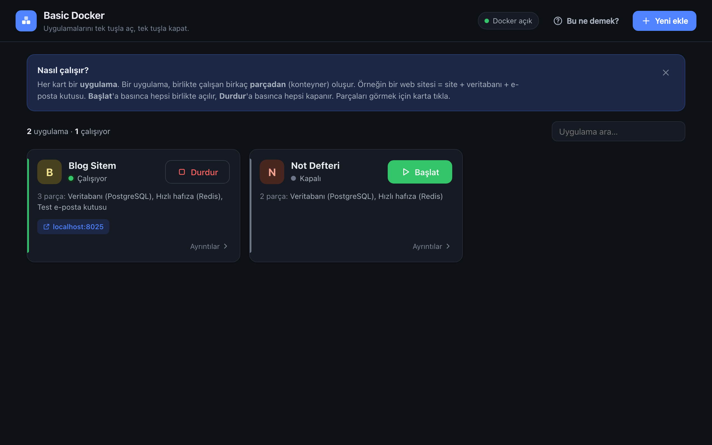
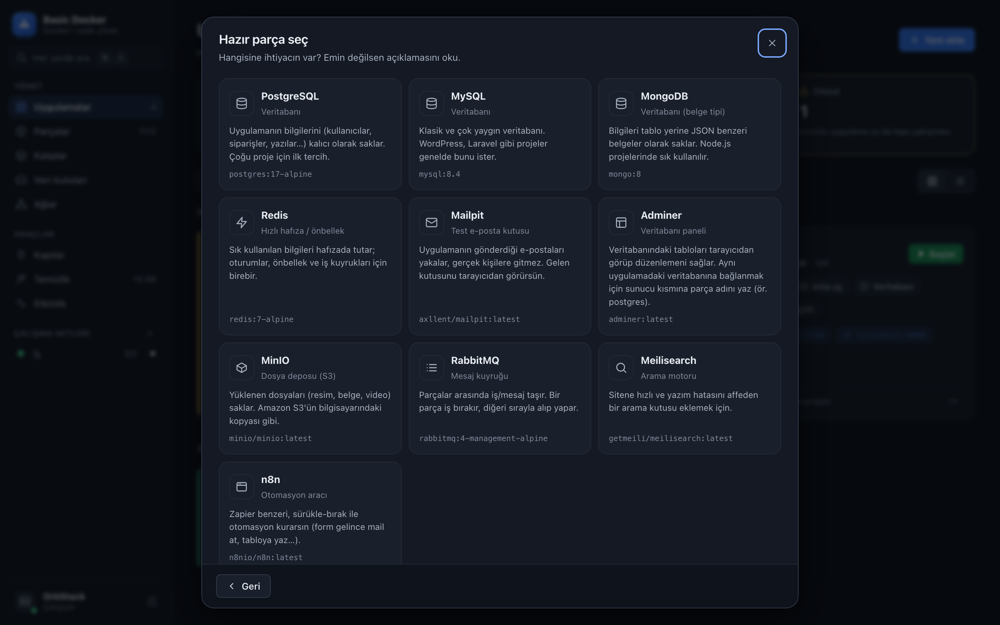
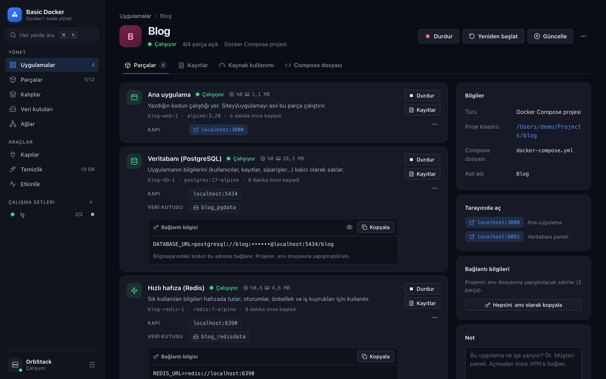

# Basic Docker

**Docker'ı mala anlatır gibi yöneten, Mac'e özel (native) uygulama.**
5 konteynerli bir proje ekranda tek kart olarak görünür. Tek tuşla hepsi açılır, tek tuşla hepsi kapanır.
Bir şey bozulunca da **neden bozulduğunu sade Türkçeyle söyler.**



Docker Desktop güçlü ama kalabalık. Bir projede `proje-web-1`, `proje-db-1`, `proje-redis-1`, `proje-worker-1` gibi
isimler birikince neyin ne olduğu karışıyor. Basic Docker bunları **uygulama** olarak toplar ve her parçanın ne işe
yaradığını sade Türkçeyle söyler. **Docker Desktop, OrbStack ve Colima** ile çalışır.

## Neler yapar?

### Günlük işler

- **Bir uygulama = bir kart.** Docker Compose projeleri kendiliğinden gruplanır. Tek başına duran konteynerleri de istediğin karta taşıyabilirsin. Kart ya da liste görünümü.
- **Tek tuş.** Başlat'a basınca uygulamanın bütün parçaları doğru sırayla açılır, Durdur'a basınca hepsi kapanır.
- **Çalışma setleri.** "İş", "Kişisel" gibi setler kur; birkaç uygulamayı kenar çubuğundan tek tuşla birlikte aç/kapat.
- **Her parça sade dille açıklanır.** "Veritabanı (PostgreSQL)", "Arka plan işçisi", "Zamanlayıcı", "Test e-posta kutusu" gibi.
- **Bağlantı adresi hazır gelir.** Veritabanı parçalarında `.env` dosyana yapıştıracağın `DATABASE_URL=…` satırı tek tıkla kopyalanır; bir uygulamanın bütün bağlantıları tek seferde `.env` olarak da kopyalanabilir.
- **Canlı kaynak kullanımı.** Her parçanın işlemci, bellek, ağ ve disk kullanımı küçük grafiklerle.
- **Kayıtlar (log).** Arama, "sadece hatalar", zaman aralığı, canlı takip. Bir uygulamanın bütün parçalarının kayıtları tek akışta da okunur.
- **Parçanın içine gir: gerçek terminal.** Uygulamanın içinde, parçanın içinde çalışan tam bir terminal (xterm.js): `cd`, sekme tamamlama, renkler, `top`, `vim` çalışır. İstersen root olarak girersin; sayfalar arasında gezinince oturum kopmaz. Veritabanına göre hazır komutlar tek tıkla terminale yazılır.
- **Compose projeleri için:** Güncelle (yeni sürümleri indir, değişenleri yeniden oluştur), kodu yeniden derle, compose dosyasını gör.

### Docker Desktop ve OrbStack'te olmayanlar

- **Teşhis: "Neden kapandı?"** Çöken parçanın çıkış kodunu ve kayıtlarındaki bilinen hataları sade Türkçeye çevirir, ne yapman gerektiğini söyler. Örnekler: kapı dolu, şifre yanlış (veritabanı şifresi sadece ilk kurulumda ayarlanır tuzağı), parçanın içinde `localhost` kullanmak, Intel kalıbını Apple Silicon'da çalıştırmak, Windows satır sonları, disk dolu, eksik tablo (migration)… Hata satırlarının yanına da kısa açıklama düşer.
- **Tek tıkla yedek ve geri yükleme.** Veri kutusunu `.tar.gz` olarak Mac'ine yedekle; PostgreSQL / MySQL / MariaDB / MongoDB için veritabanının kendi aracıyla **döküm** al. Yedekleri yeni bir kutuya ya da var olanın üzerine geri yükle. Silinen yedek Çöp Sepeti'ne gider.
- **Kapı haritası.** Bilgisayardaki hangi numarayı kim kullanıyor: Docker parçaları, diğer programlar ve macOS'un kendisi (ör. 5000/7000'i tutan AirPlay Alıcısı). "Bu uygulamayı başlatırsan şu kapı çakışır" uyarısı, ağdaki herkese açık kapılar için uyarı ve boş kapı bulucu.
- **Akıllı temizlik.** Docker'ın diskte ne kadar yer kapladığını kategorilere ayırır; derleme önbelleği ve sahipsiz kalıplar gibi güvenli olanları önceden seçer, riskli olanları (veri kutuları) tek tek seçtirir ve silmeden önce yedek almayı önerir.
- **Etkinlik geçmişi.** Docker bu geçmişi kısa tutar; Basic Docker açıkken olanları (başladı, durdu, çöktü, belleği yetmedi…) kaydeder. Bir parça beklenmedik şekilde çökerse **macOS bildirimi** gönderir.
- **Kalıp güncelleme denetimi.** İndirdiğin kalıpların Docker Hub'da yeni sürümü var mı? Intel (amd64) için yapılmış, Mac'inde emülasyonla yavaş çalışan kalıpları da işaretler. Bir kalıbın çok sayıdaki eski sürümünü tek tuşla temizler.
- **Sade dil ↔ teknik terimler.** "Parça, kalıp, veri kutusu" yerine istersen "konteyner, imaj, volume".

### Diğer her şey

- **Parçalar:** bütün konteynerler tek tabloda; sıralama, filtre ve toplu başlat/durdur/sil. Duraklat, zorla kapat, yeniden başlama kuralı, başka bir ağa bağla, ortam değişkenleri (şifreler gizli) ve ham `docker inspect` bilgisi.
- **Kalıplar:** indir, çalıştır, katmanlarını incele, sil. **Veri kutuları:** oluştur, yedekle, sil. **Ağlar:** hangi parça hangi ağda, hangi IP ve adla; oluştur, bağla, çıkar, sil.
- **Sistem:** motor bilgisi (OrbStack / Docker Desktop / Colima), sürümler, birden fazla Docker varsa bağlam (context) değiştirme. Motor kapalıysa doğru uygulamayı (OrbStack'i ya da Docker Desktop'ı) açar.
- **Her yerde arama: ⌘K.** Uygulama, parça, sayfa ya da işlem yaz; Enter'la yap ("blog başlat", "temizlik"…). Diğer kısayollar: ⌘N yeni ekle, ⌘1…⌘9 sayfalar, `/` arama.
- Açık / koyu tema (macOS'u izler), dar kenar çubuğu, küçük pencerede de düzgün görünüm.

### Yeni ekleme üç yoldan yapılır

- **Hazır parça:** PostgreSQL, MySQL, MongoDB, Redis, Mailpit, Adminer, MinIO, RabbitMQ, Meilisearch, n8n. Şifre, kapı ve veri kutusu otomatik ayarlanır.
- **Proje klasörüm:** `docker-compose.yml` olan klasörü seçersin, her şey tek seferde kurulur.
- **Docker Hub'dan imaj:** İstediğin imajı kendi kapı ve ayarlarınla çalıştırırsın.





## Kurulum

Gerekenler: **macOS 11+**, **Python 3.9+** (macOS'ta hazır gelir) ve bir Docker motoru:
**[OrbStack](https://orbstack.dev)** (Mac için en hafifi) ya da **[Docker Desktop](https://www.docker.com/products/docker-desktop/)**.

```bash
git clone https://github.com/benysff/basic-docker.git
cd basic-docker
./kur.command
```

Kurulum 1-2 dakika sürer. Bitince uygulama **Uygulamalar** klasörüne yerleşir ve açılır.
Bundan sonra Launchpad'den ya da Spotlight'tan (⌘ + boşluk → *Basic Docker*) açarsın; terminal açılmaz.

> Klonladığın klasörü taşırsan ya da `git pull` ile güncellersen `./kur.command`'ı tekrar çalıştır.

## Sık sorulanlar

**Yeni projem otomatik görünür mü?**
`docker compose up` ile çalıştırdıysan evet, kendiliğinden tek kart olur. Konteynerleri tek tek `docker run` ile
açtıysan ayrı kartlar olarak görünürler; ayrıntılardaki **Uygulamaya ekle** ile birleştirebilirsin.

**`docker compose down` yaparsam kart kaybolur mu?**
Hayır. Compose projeleri hatırlanır. Kartta Başlat'a basınca proje klasöründen yeniden kurulur.

**Silince verilerim gider mi?**
Varsayılan olarak hayır. Veriler (veri kutuları) korunur. Silmek için ayrıca "Verileri de sil" kutusunu
işaretlemen gerekir. Proje klasörüne ve kodlarına hiçbir zaman dokunulmaz. Emin değilsen önce **Yedekle**.

**Yedekler nerede durur?**
`~/Documents/Basic Docker Yedekleri` klasöründe (Sistem sayfasından değiştirilebilir). Veri kutusu yedekleri için
bir kere küçük bir yardımcı kalıp (`alpine`, ~3 MB) kullanılır; bilgisayarında yoksa indirilir.

**Güvenli mi?**
Hazır parçaların kapıları sadece senin bilgisayarına açılır (`127.0.0.1`), ağdaki başkaları erişemez.
Uygulama ağa hiçbir şey açmaz; tamamen yerel çalışır ve sadece `docker` komutunu kullanır. İnternete sadece
sen istediğinde çıkar (kalıp indirme, güncelleme denetimi).

## Nasıl çalışır?

Basic Docker bir Python uygulamasıdır. Arayüzü [pywebview](https://pywebview.flowrl.com/) ile native bir macOS
penceresinde (WKWebView) açar. Web sunucusu ya da port kullanmaz: arayüz Python fonksiyonlarını doğrudan çağırır.
Docker ile sadece `docker` komut satırı aracı üzerinden konuşur.

Konteynerleri şu sırayla gruplar:

1. Basic Docker ile kurulanlar (`basicdocker.app` etiketi)
2. Docker Compose projeleri (`com.docker.compose.project` etiketi)
3. Elle gruplananlar
4. Kalanlar tek başına kart olur; Docker'ın kendi yardımcıları (buildx vb.) en altta ayrı durur

| Dosya | Ne yapar |
|---|---|
| `app.py` | Pencereyi açar ve arayüzün çağırdığı işlemleri Python'a bağlar |
| `docker_service.py` | Uygulamalar ve parçalar: okuma, gruplama, açıklamalar, başlat/durdur/sil/oluştur, setler |
| `resources.py` | Kalıplar, veri kutuları, ağlar, kapı haritası, temizlik, motor bilgisi |
| `terminal.py` | Uygulama içi terminal: `docker exec -it` oturumlarını sözde terminal (PTY) üzerinden yönetir |
| `insights.py` | Teşhis: çıkış kodları ve kayıtlardaki bilinen hatalar → sade Türkçe açıklama |
| `backups.py` | Veri kutusu yedeği, veritabanı dökümü ve geri yükleme |
| `monitor.py` | Arka planda canlı kaynak kullanımı ve etkinlik geçmişi (çökme bildirimi) |
| `catalog.py` | Hazır parça listesi |
| `static/` | Arayüz: `css/` (tasarım belirteçleri, bileşenler) ve `js/` (her sayfa `views/` altında ayrı dosya), `vendor/xterm/` (xterm.js 6, MIT, internetsiz çalışsın diye dahil) |
| `kur.command`, `setup.py` | Kurulum ve `.app` paketi |

Ayarlar (görünen adlar, notlar, elle gruplamalar, setler, tercihler) `~/.basic-docker/ayarlar.json`,
etkinlik geçmişi `~/.basic-docker/etkinlik.jsonl` dosyasında durur.

### Geliştirme

```bash
./kur.command                              # bir kere, .venv'i hazırlar
.venv/bin/python app.py --gelistirici      # web denetçisi (sağ tık → Öğeyi İncele) açık çalıştırır
```

- Yeni bir hazır parça eklemek için `catalog.py`'ye bir kayıt eklemen yeterli.
- Yeni bir hata açıklaması eklemek için `insights.py`'deki `PATTERNS` listesine bir satır ekle.
- `index.html`'de andığın bütün `css/` ve `js/` dosyaları açılışta tek sayfaya gömülür; derleme adımı yok.

## Lisans

[MIT](LICENSE)
